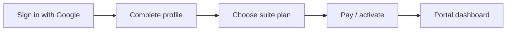

# Customer account — profile, address & onboarding journey

## User journey (Phase 1)



1. **Sign in with Google (SSO)** — `/sign-in` → `Continue with Google`
2. **Complete profile** — `/onboarding/complete-profile` (phone, ID, delivery preferences)
3. **Suite eligible** — only after profile is complete
4. **Choose plan + pay** — `/onboarding/choose-suite-plan` → `/suite-access/checkout`
5. **Portal** — `/dashboard` and other routes (requires assigned suite)

Route guards enforce this order. Users cannot open the dashboard without a profile and suite.

## Mock development (`environment.useMock: true`)

| Action | Result |
|--------|--------|
| **Continue with Google** (or “Simulate new Google sign-up”) | New user, incomplete profile, no suite → step 2 |
| **Skip to full demo** | Sabelo Dlamini with profile + suite → dashboard |
| `*@weyell.demo` / `demo1234` | Seven personas seeded in MongoDB (`Seed:DemoData`) — see [DOCKER.md](./DOCKER.md) for the full list |

Auto sign-in on page load is **disabled** so the journey always starts at sign-in.

## Live SSO (`npm run dev:portal:bff`)

Google redirects through `/bff/auth/login`. After callback, guards send incomplete profiles to `/onboarding/complete-profile`.

## Key files

| Piece | Path |
|-------|------|
| Models | `frontend/apps/customer-portal/src/app/models/customer-account.models.ts` |
| Mock store | `frontend/apps/customer-portal/src/app/data/customer-account.mock.ts` |
| Journey service | `frontend/apps/customer-portal/src/app/services/customer-account.service.ts` |
| Guards | `frontend/apps/customer-portal/src/app/guards/customer-journey.guard.ts` |
| Complete profile UI | `frontend/apps/customer-portal/src/app/features/onboarding/complete-profile.component.ts` |
| My address (post-onboarding) | `/my-address` |

## Profile completeness

Required before suite eligibility:

- First & last name  
- Phone  
- ID / passport number & type  
- Preferred delivery method  

## Backend API (`/api/v1/borderbox/account`)

Wired when `environment.useMock` is `false` (e.g. `npm run dev:portal:bff`).

| Method | Path |
|--------|------|
| GET | `/borderbox/account` |
| PATCH | `/borderbox/account/profile` |
| PATCH | `/borderbox/account/notifications` |
| POST/PUT/DELETE | `/borderbox/account/delivery-addresses` |

- Google SSO: `SsoSignInGoogleCommand` → `User.CreateForSso` as `Customer`
- Profile fields on `User` (first/last name, ID, delivery preference)
- `CustomerAddress` for SA suite + Eswatini delivery rows
- `POST /borderbox/suite-access/checkout` returns `account.profile_incomplete` until profile is complete

## Run with API

```bash
cd backend/api && docker compose up api bff-customer
cd frontend && npm run dev:portal:bff
```
